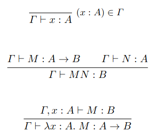

# 1

2026-07-27

I am overwhelmed by the amount of resources and what I want to learn.

- Reading [Journal of Automated Reasoning](https://link.springer.com/journal/10817)
- Reading [this](https://link.springer.com/article/10.1007/s10817-026-09750-3) and other quantum related articles
- Learning Haskell

But the question is - what's gonna be the deliverable? What is the aim? Final product? Ideally it would be a presentation in [The Science Guild](https://www.thescienceguild.org), and that would be, I guess, the way to contain all the distraction of infinite learning topics and resources. The topic for the presentation would be something simple, but the preparation would cover much more, so that I would comfortable convey the message and answer questions related to that topic. I am thinking of the topic of basic proof that $1 + a - a = 1$, or something like that with natural numbers. And then maybe some kind of equivalent with trees or lists (so that induction proofs would be more clear). Part of the presentation could be typing everything in Lean (from scratch). Another part of the presentation (probably the ending) would be about relevance and further learning aims, such as typing quantum information theory theorems or something like that. Finally, The Science Guild meeting might not happen - then it would be just a short paper written in LaTeX, covering all these topics as if the presentation would happen. But the paper would be written either way (and later placed in my portfolio website), so I guess **the paper will be the main outcome of this learning**, and only optionally a presentation or a YouTube tutorial will follow.

_Overview of the resource._ The Hitchhiker's Guide is just a PDF with a little more text than there is in .lean files in github repo with demo-exercises-homework. So reading the actual PDF is not that worth it, unless extended explanation is needed.

_Dependent type theory._ [Some lecture slides](https://www.asc.ohio-state.edu/pollard.4/type/readings/barthe-dtt-hol.pdf) say that it's just a programming language. And since it is for proofs, we have the Curry-Howard isomorphism (Lambek also relates to category theory):

```
Proposition --- Type
Proof --- Term
Proof-checking --- Type-checking
```

Syntax:

```
Types: T = B (base type) | T -> T (function type)
Expressions: E = V (var) | EE (app) | \.V:T.E (abs)
Judgements: x1:A1, ... xn:An (context) |- M (subject/function) : B (predicate/type)
```

Typing rules:



<!--
\begin{mathpar}
    \inferrule*[right=$(x:A)\in\Gamma$]{\;}{\Gamma \vdash x:A}
\end{mathpar}

\begin{mathpar}
    \inferrule{\Gamma \vdash M : A \rightarrow B \\ \Gamma \vdash N : A}{\Gamma \vdash MN : B}
\end{mathpar}

\begin{mathpar}
    \inferrule{\Gamma, x:A \vdash M:B}{\Gamma \vdash \lambda x:A.\; M : A \rightarrow B}
\end{mathpar}
 -->

Also, if $\Gamma \vdash M:A$ then $\Gamma \vdash A$ and if $\Gamma \vdash A$ then $\Gamma \vdash M:A$ for some $M$.

_Calculus of inductive constructions._ Typed HOL (higher-order logic). It has terms $e ::= \mathbf T | \mathbf P | x | ee | \lambda x:e.\;e | \forall x:e.\;e$, where **T** is type, **P** is prop (the type of all propositions).

Since we are already diving too deep, let's go through The Hitchhiker's Guide repo and analyze all the demos (exercises later).
